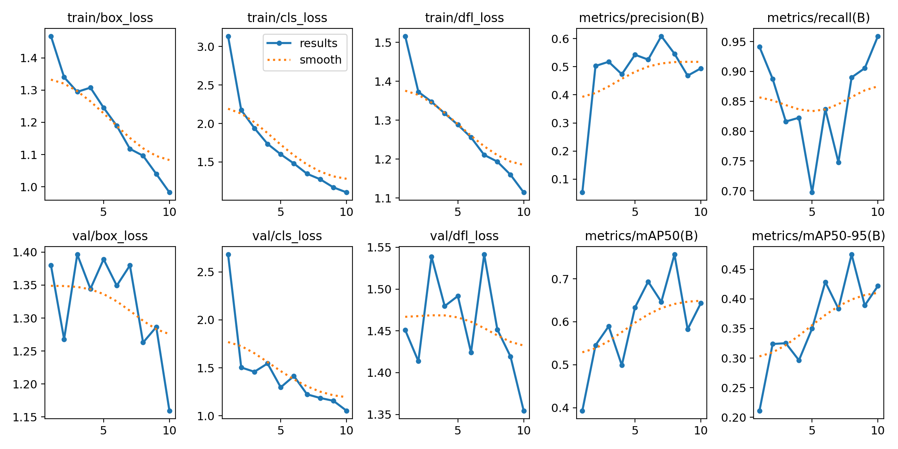
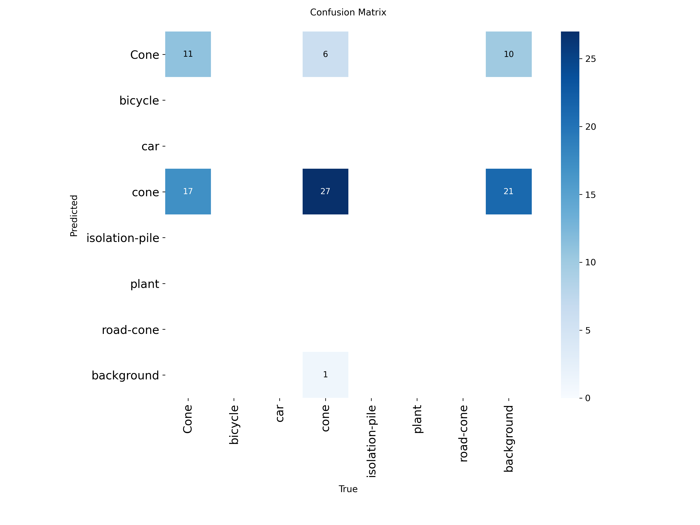
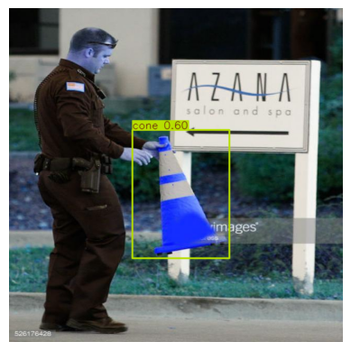

# YOLOv8 Traffic Cone Detection (Fine-tuning)

This project demonstrates how to fine-tune the YOLOv8 object detection model to detect **traffic cones** using a custom dataset.

---

## 🚀 Project Overview
- **Framework**: [Ultralytics YOLOv8](https://github.com/ultralytics/ultralytics)
- **Task**: Object detection (Traffic Cones)
- **Approach**: Fine-tuning a pretrained YOLOv8 model with a custom dataset.

---

## 📂 Training Steps

### 1. Install YOLOv8
```bash
!pip install ultralytics
```
2. Download dataset
Used Roboflow to prepare and download dataset.

3. Train the model
```
!yolo detect train data=data.yaml model=yolov8n.pt epochs=30 imgsz=640
```
data.yaml → Specifies dataset paths, class names, and number of classes.

yolov8n.pt → Pretrained YOLOv8 nano model used as base (transfer learning).

epochs=30 → Number of training iterations.

📊 Training Results
Training Curves: loss, precision, recall, mAP.

Results: show performance improvements over time.




Confusion Matrix: evaluates model prediction vs ground truth.



Sample Inference (Detected Traffic Cone)




🎯 Why Transfer Learning?
Instead of training from scratch, we used pretrained weights and fine-tuned them on our traffic cone dataset.
This speeds up training, requires less data, and achieves better results.

⚡ Challenges & Learnings
Data preparation: Adjusted dataset paths in data.yaml to match Colab environment.

Training stability: Ensured correct image sizes and batch sizes.

Saving outputs: Mounted Google Drive to persist training results and notebook.

Outcome: Successfully fine-tuned YOLOv8 to detect traffic cones with good accuracy.

📜 Reflection
This project shows how flexible YOLOv8 is for adapting to new object detection tasks with minimal dataset and resources
